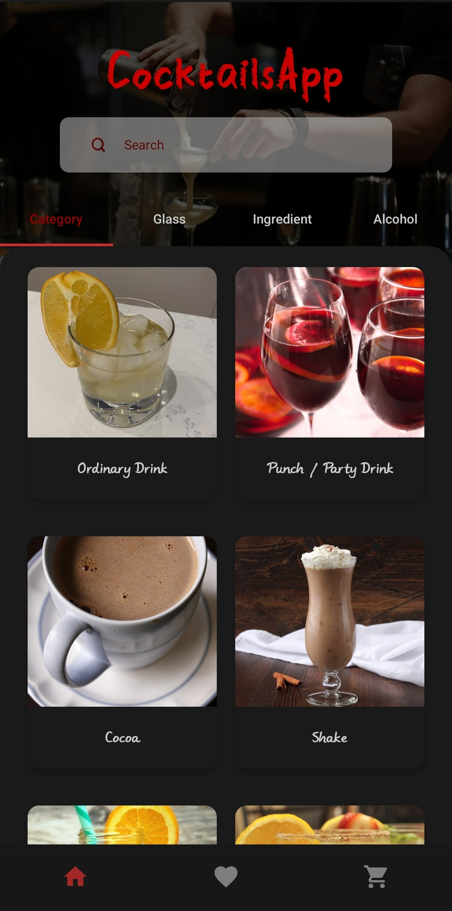
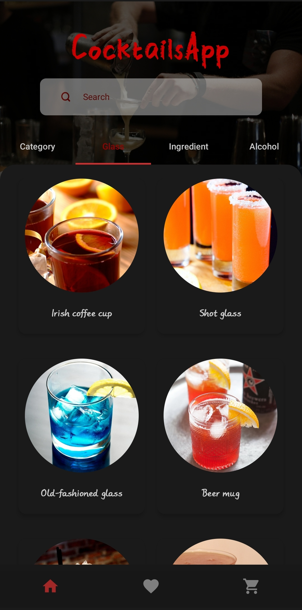
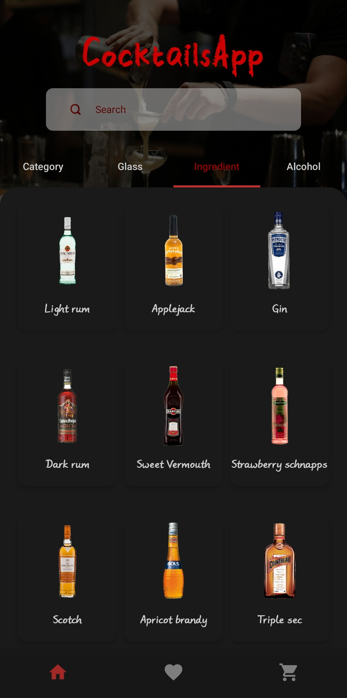
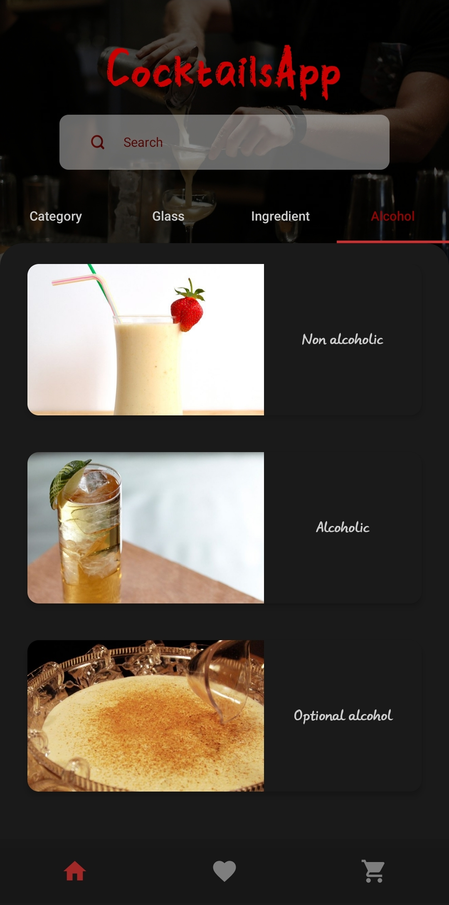
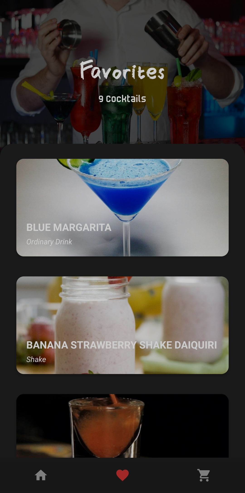
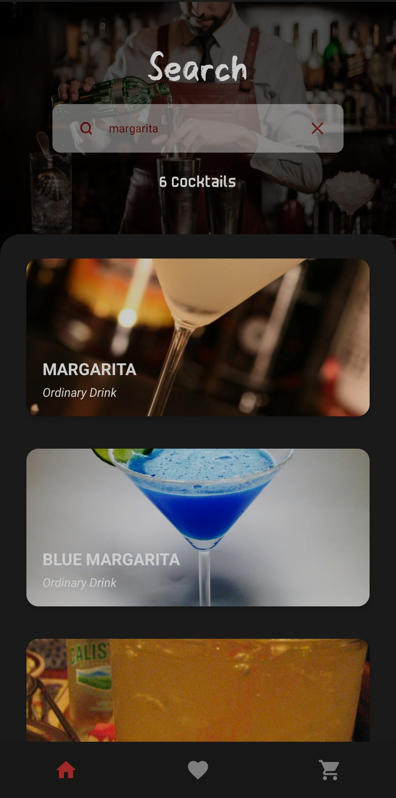
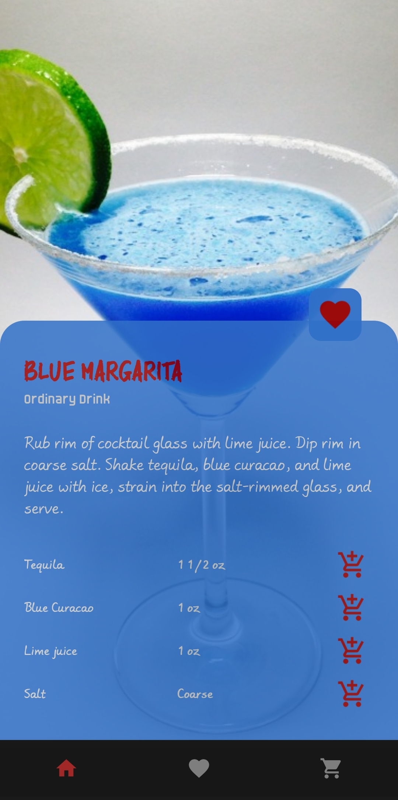
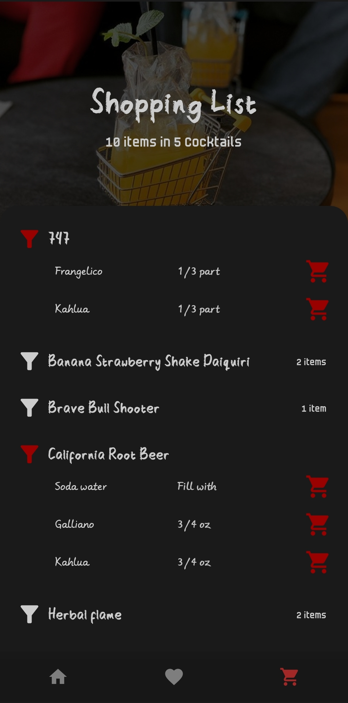

# CocktailsApp

It's an app to prepare your dream cocktails. Users can browse cocktails, sort them by category, glass, ingredient and to be alcoholic. They can save cocktails to favorites. Ingredients can be added to shopping list, so they can know which cocktail they wanna prepare and which ingredients needed they do not have at the moment.<br /><br />
Project is written in Kotlin.💯

<br />

| Category | Glass | Ingredient | Alcohol |
|------|------|------|------|
|  |  |  |  |


<br />

| Favorites | Search | Details | Shopping |
|------|------|------|------|
|  |  |    |  |

<br />

**It's recommended to use in dark mode but light mode alternative also presented.

<br />

### The Aim Of The Project
Develop an app with new technologies and best practices in android development such as:
- [Clean Architecture](https://medium.com/android-dev-hacks/detailed-guide-on-android-clean-architecture-9eab262a9011) - Clean architecture is a software design philosophy that separates the elements of a design into ring levels.<br /><br />
- [SOLID](https://medium.com/the-android-caf%C3%A9/solid-principles-the-kotlin-way-ff717c0d60da) - SOLID is a mnemonic acronym for five design principles intended to make software designs more understandable, flexible, and maintainable.<br /><br />
- [TDD](https://developer.android.com/training/testing/fundamentals) - Testing is an integral part of the app development process. By running tests against your app consistently, you can verify your app's correctness, functional behavior, and usability before you release it publicly.<br /><br />
- [CI/CD](https://resources.github.com/ci-cd/) - CI/CD comprises of continuous integration and continuous delivery or continuous deployment. Put together, they form a CI/CD pipeline —a series of automated workflows that help DevOps teams cut down on manual tasks.<br /><br />
- [MVVM](https://developer.android.com/topic/libraries/architecture/viewmodel) - Its principal advantage is that it caches state and persists it through configuration changes.<br /><br />
- [HILT](https://dagger.dev/hilt) - Hilt provides a standard way to incorporate Dagger dependency injection into an Android application.<br /><br />
- [Navigation Components](https://developer.android.com/guide/navigation/navigation-getting-started) - Navigation component helps you implement navigation, from simple button clicks to more complex patterns, such as app bars and the navigation drawer.<br /><br />
- [Architecture Components](https://developer.android.com/topic/libraries/architecture) - It's a new collection of libraries that contains the lifecycle-aware components. It can solve problems with configuration changes, supports data persistence, reduces boilerplate code, helps to prevent memory leaks and simplifies async data loading into your UI.<br /><br />
- [Firebase](https://firebase.google.com/) - Firebase is an app development platform that helps you build and grow apps and games users love. Backed by Google and trusted by millions of businesses around the world.<br /><br />
- [Retrofit](https://square.github.io/retrofit/) - A type-safe HTTP client for Android and Java. Retrofit turns your HTTP API into a Java interface.<br /><br />
- [Flows](https://developer.android.com/kotlin/flow) - In coroutines, a flow is a type that can emit multiple values sequentially, as opposed to suspend functions that return only a single value.<br /><br />
- [Coroutines](https://kotlinlang.org/docs/reference/coroutines-overview.html) - In addition to opening the doors to asynchronous programming, coroutines also provide a wealth of other possibilities, such as concurrency and actors.<br /><br />
- [LiveData](https://developer.android.com/topic/libraries/architecture/livedata) - LiveData is an observable data holder class. Unlike a regular observable, LiveData is lifecycle-aware, meaning it respects the lifecycle of other app components, such as activities, fragments, or services.<br /><br />
- [ViewBinding](https://developer.android.com/topic/libraries/view-binding) - View binding is a feature that allows you to more easily write code that interacts with views. Once view binding is enabled in a module, it generates a binding class for each XML layout file present in that module.<br /><br />
- [Palette](https://developer.android.com/develop/ui/views/graphics/palette-colors) - Good visual design is essential for a successful app, and color schemes are a primary component of design. The Palette library is a Jetpack library that extracts prominent colors from images to create visually engaging apps.<br /><br />
- [Glide](https://github.com/bumptech/glide) - Glide is a fast and efficient open source media management and image loading framework for Android that wraps media decoding, memory and disk caching, and resource pooling into a simple and easy to use interface.

<br />

### License
```
   Copyright (C) 2024 Mert Yazı
   Licensed under the Apache License, Version 2.0 (the "License");
   you may not use this file except in compliance with the License.
   You may obtain a copy of the License at

       http://www.apache.org/licenses/LICENSE-2.0

   Unless required by applicable law or agreed to in writing, software
   distributed under the License is distributed on an "AS IS" BASIS,
   WITHOUT WARRANTIES OR CONDITIONS OF ANY KIND, either express or implied.
   See the License for the specific language governing permissions and
   limitations under the License.
```
<br />

### Contributing
- Just make a pull request.
- Study API from "https://thecocktaildb.com/api.php"
